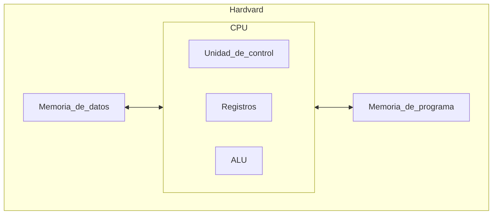
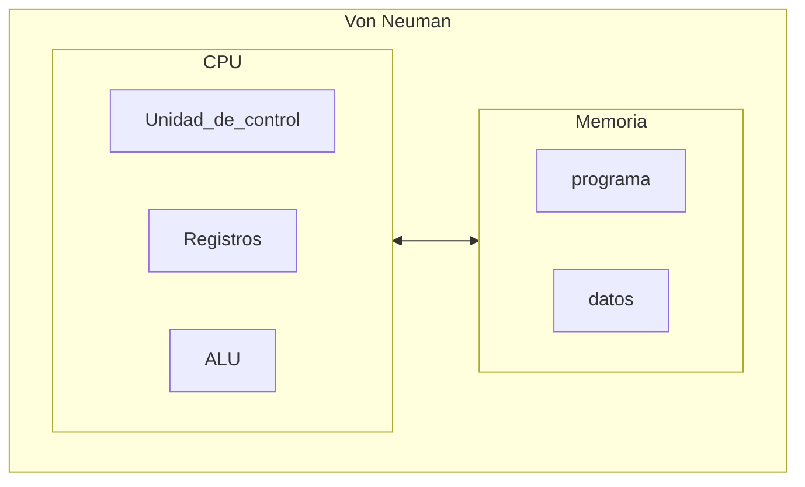
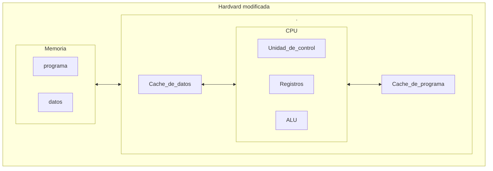

# Las arquitecturas

Explicaremos alguna de las arquitecturas mas comunes actualmente:

----

### - Aquitectura hardvard:
Lo podemos encontrar en sistemas embebidos como Arduino, y se componen por: 

1. `ALU`: Tambien llamada unidad aritmetico logica
2. `Unidad de control`:
3. `Registros`:
4. `Memoria de datos`: almacenaremos datos en ella.
5. `Memoria de programa`: donde se almacenara el codigo del programa a ejecutar.

Esta arquitectura nos permite trabajar en paralelo, es decir, la `CPU` puede cargar la siguiente instrucion a ejecutar del programa mientras a la vez, puede leer o escribir datos que se vayan o se hayan usado en el programa. 

----

### - Arquitectura Von Neuman:

Esta arquitectura tiene una unica memoria donde se almacena las instruciones del codigo a ejecutar, y los datos. Siendo una separacion logica y no fisica. Este arquitectura pose cuello de botella entre la comunicacion de la memoria con la `CPU`. Esta arquitectura no permite el paralelismo que nos otorgaba la arquitectura Hardvard, por lo tanto, solo podremo leer o escribir un dato del programa, no podremos realizr ambos al mmismo tiempo.

### - Arquitectura Hardvard modificada:
Los procesadores `Intel` o `AMD` actuales, usan esta arquitectura.
Los procesadores actuales cuentan con memorias cache donde almacenan datos e instruciones. Si no encuentras los datos en los registros, buscara en el cache de datos o de programa `L1`, si no esta ahi busca en `L2` y asi de forma continua con cada memoria cache. Aunque la unica memoria que esta dividad en dos es `L1`, formando dos memorias. Todas las demas se encuentran juntas en una unica memoria. Si el dato no existe en los registros o en las cache, sera cuando vayan a pedir los datos a la memoria mediante el controlador de `E/S`

----

----