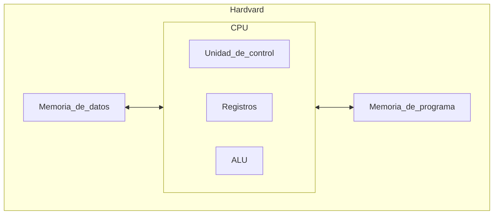
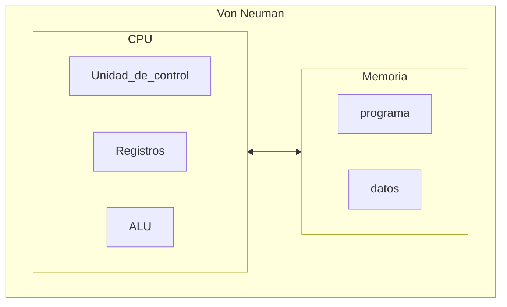
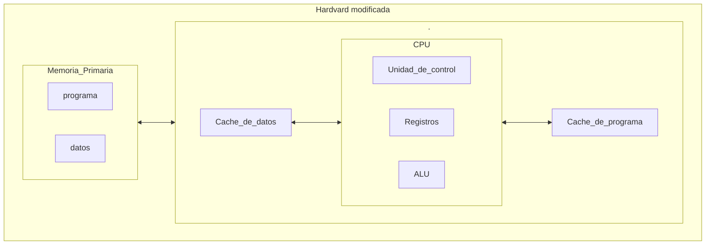

# Las arquitecturas

Explicaremos alguna de las arquitecturas mas comunes actualmente:

----

### - Aquitectura hardvard:
Lo podemos encontrar en sistemas embebidos como Arduino.

Esta arquitectura nos permite trabajar en paralelo, es decir, la `CPU` puede cargar la siguiente instrucion a ejecutar del programa mientras a la vez, puede leer o escribir datos que se vayan o se hayan usado en el programa. 

----

### - Arquitectura Von Neuman:

Esta arquitectura tiene una unica memoria donde se almacena las instruciones del codigo a ejecutar, y los datos. Siendo una separacion logica y no fisica. Este arquitectura pose cuello de botella entre la comunicacion de la memoria con la `CPU`. Esta arquitectura no permite el paralelismo que nos otorgaba la arquitectura Hardvard, por lo tanto, solo podremo leer o escribir un dato del programa, no podremos realizr ambos al mmismo tiempo.

### - Arquitectura Hardvard modificada:
Los procesadores `Intel` o `AMD` actuales, usan esta arquitectura.
Los procesadores actuales cuentan con memorias cache donde almacenan datos e instruciones. Si no encuentras los datos en los registros, buscara en el cache de datos o de programa `L1`, si no esta ahi busca en `L2` y asi de forma continua con cada memoria cache. Aunque la unica memoria que esta dividad en dos es `L1`, formando dos memorias. Todas las demas se encuentran juntas en una unica memoria. Si el dato no existe en los registros o en las cache, sera cuando vayan a pedir los datos a la memoria mediante el controlador de `E/S`

----

----

Actualmente los procesadores de `AMD` y `intel` tiene el mismo conjunto de instrcuiones (`8086`). Esto se debe a que la empresa que creo este conjunto fue intel, y las demas crearon procesadores clonicos que hacian uso del mismo conjunto. Es por esto, que es independiente la marca o fabricante del producto, pues estaran usando este mismo conjunto. Esto se hizo asi para que el software desarollado para procesadores `intel` fuera ompatibles con los procesadores de los demas fabricantes. Adoptando el mismo conjunto de instruciones para tu procesador, esto permite usar el software que se haya diseñado con dicho conjunto de instruciones. No existe mucha diferencia entre un procesador actual, y los procesadores de los años 80 de intel (`8086`) Lo unico que a cambiado y mejorado, es el tamaño de los registros, la eficiencia energetica, el numero de nucleos y etc. Pero en su base, siguen siendo el mismo.

----

### Nuestra CPU (Unidad Central de Procesamiento):
Se compone por:

1. `(ALU) Unidad Aritmetica Logica`: [ALU](./unidad-aritmetica-logica.md), es un circuito que permite realizar operaciones arimeticas basicas como sumar y restar. Tambien permite realizar operaciones logicas a nivel de bits, conocidas tambien como operaciones [Bitwise](./bitwise-basicos-md). Estas operaciones en su base son, `not`, `and`, `or`, `xor` y etc. Actualmente los procesadores cuentan con una ALU compleja y potente, de hecho, hay procesadores que tienen una ALU por nucleo.
   
2. `(UC) Unidad de control`: Su tarea es buscar las instruciones a ejecutar en la mmeoria, interpretarlas y ejecutarlas ayudandose de la Unidad de Proceso. 
   
3. `Unidad de Proceso`: Esta unidad tiene como fin llevar a cabo las tareas que le encomienda la unidad de control. La unidad de proceso cuenta a su vez con una (FPU)`unidad de coma flotante` para realizar operaciones con numeros reales de forma eficiente. Cuenta con un `registro acumulador` que guarda operandos y resultados de las operaciones. Tiene un `registro de estado` donde se guarda algunas informaciones de las operaciones que se a realizado, como si el valor es cero, o negativo entre otras. Y esta undad cuenta con la `ALU`.
   
4. `Registros`: Los [registros](./registros-cpu.md) de la cpu son memorias pequeñas y de rapido acesso. Como los registros generales, el registro acumulador, el registro de estado entre otros y etc.
   
5. `MP`: Tambien llamado como Memoria primaria, memoria princiapal, memooria interna o memoria central, es aquella en la que se almacenan los datos y las intruciones a ejecutar en el caso de las arquitecturas Hardvard modificada. La `MP` se comunica con la `CPU` mediante `buses de datos` y el `bus de direcciones`.