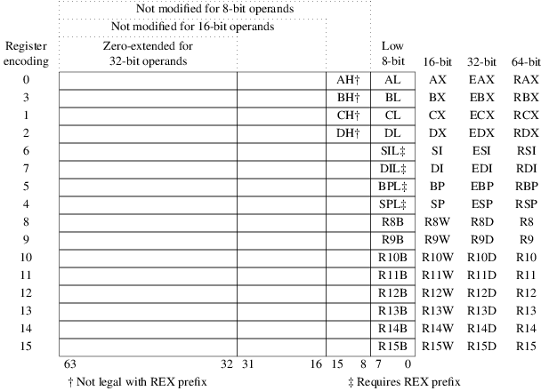

# Registros de una CPU intel x86

## - ¿Que es un registro?
En nuestra `CPU` podemos encontrar unas "memorias" especiales que se llaman registros, estas son mas rapidas que la `RAM` pero tiene un menor tamaño. Su tamaño depende de la arquitectura del procesador y de si el mismo de de 64, 32, 16 u 8bits. Estas memorias especiales las llamamos "registros". Si nuestra CPU es de `32bits`, nosotros no dispondremos de registros de `64bits` obivamente, pero si podremos hacer uso de estos para hacer divisiones de registros, es decir, si nuestro registro mas grande es de `32bits`, podemos dividirlo y tener dos registros de `16bits`, a su vez, uno de estos registros de `16bits` podemos partirlos en 2 registro de `8bits`. Tal vez te preguntes por que alguien querria hacer esto, la respuesta es mas simple de lo que parece y es por temas de compatibilidad. Imaginense que tienen una CPU de `64bits` con sus correspondientes registro de 64 y queremos correr programa de `32bits`, lo que podemos hacer es "dividir" esos registros de `64bits` para obetener los de `32bits`, aunque la otra mitad no se usaran para nada. Este sistema nos permite tener una compatibilidad para ejecutar programas de 64, 32, 16 u 8bits siempre y cuando podamos hacer las divisiones necesarias. 
Aunque no siempre es por esto, otras veces simplemente querremos optimizar nuestro codigo, y tal vez un registro de `64bits` sea demasiado grande para lo que queremos.

----
### Aqui tenemos los registros de 64, 32, 16 y bits:

Para nosotros, los registros mas importantes seran por ahora los de tipo `a`, `b`, `c`, `d`, `sp` y `bp` de 8, 16, 32 y 64bits

|Nombre del registro| Tamaño |
|:-----------------:|:------:|
|`ah`               |`8 bit` |
|`al`               |`8 bit` |
|`bh`               |`8 bit` |
|`bl`               |`8 bit` |
|`ch`               |`8 bit` |
|`cl`               |`8 bit` |
|`dh`               |`8 bit` |
|`dl`               |`8 bit` |
|`bpl`              |`8 bit` |
|`spl`              |`8 bit` |
|`ax`               |`16 bit`|
|`bx`               |`16 bit`|
|`cx`               |`16 bit`|
|`dx`               |`16 bit`|
|`bp`               |`16 bit`|
|`sp`               |`16 bit`|
|`eax`              |`32 bit`|
|`ebx`              |`32 bit`|
|`ecx`              |`32 bit`|
|`edx`              |`32 bit`|
|`ebp`              |`32 bit`|
|`esp`              |`32 bit`|
|`rax`              |`64 bit`|
|`rbx`              |`64 bit`|
|`rcx`              |`64 bit`|
|`rdx`              |`64 bit`|
|`rsp`              |`64 bit`|
|`rbp`              |`64 bit`|
----
### - Registros de tipo A:
En realidad creo que nadie los llama asi, pero bueno, para entendernos llamaremos a los registros `rax`, `eax`, `ax`, `ah`, `al` de tip A, ya que todos estos cumplen en teoria una misma funcion. Normalmente, con estos registros se escoje el servicio a usar, por asi decir, es el registro que usaremos normalmente para realizar la ejecucion de una funcion del sistema o etc, es decir, supongamos que queremos imprimir algo por pantalla en un sistema linux. Normalmente para esta tarea usamos lo que llamamos una "interrupcion", lo cual explicaremos mas adelante lo que es. La interupcion que se usa en linux para esto es la `80h` que es lo mismo que `0x80` en hexadecimal, donde tenemos que poner en el registro `eax` por ejemplo, el valor 4, para especificar que queremos usar `sys_write`, que traducido a español, es la llamada para escritura, luego se usan los demas registros para especificar que hacer esactamente, pero eso ahora no importa. Otro ejemplo seria poner en el registro `ah` el valor de `0x00` y hacer una interupcion (`10h` == `0x10`), con esto hacemos una interupcion al BIOS para decirle que queremos cambiar el modo de bideo. Tal vez te preguntes como saber que valor poner en este registro para realizar una tarea en especifico, para eso, depende de si quieres hacer una interrupcion ("hablar") con el BIOS, con el sistema o etc. El BIOS tiene la interupcion 10h, linux la 80h, el DOS la 21H y asi, sabiendo que interupcion queremos realizar, podemos buscar en internet por ejemplo la "tabla de servicios" de la interupcion que deseamos, y en esta nos especificaran los distintos servicios, valores de configuracion y utilidad de estas. 
|Para entendernos|Como realmente se llaman|
|:----:|:----:|
|`a64` | `rax`|
|`a32` | `eax`|
|`a16` |  `ax`|
|`a8l` |  `ah`|
|`a8h` |  `al`|
----

### - Registros de tipo B:
Estos son los registros `rbx`, `ebx`, `bx`, `bh`, `bl` y los estaremos llamando de tipo B por simplicidad. `rbx` sera nuestro registro B de `64bits ` `b64`. El registro `b32` sera el `ebx` que es el registro de tipo B de `32bits`. EL registro B de 16 bits o `b16` sera `bx` y aqui ahora tenemos un conflicto de nombres ya que ambos son de `8bits`. Para este caso los llamaremos tal cual pero sustitullendo la `b` por `b8` delante del nombre de cada registro, ya explicare mas tarde el por que. `b8l` = `bh` y `b8l` = `bl`. No es necesario que los llames en `b64`, `b32`, `b16`, `b8h` o `b8l` ya que nadie los llama asi y realmente se llaman como se digo en primera instancia, pero volvemos a que es por simplificar, ya qye con el `b` sabemos que hablamos de los registros de tipo B, con el `32` sabemos que hablamos del de `32bis`, es decir, de `ebx`.
|Para entendernos|Como realmente se llaman|
|:----:|:----:|
|`b64` | `rbx`|
|`b32` | `ebx`|
|`b16` |  `bx`|
|`b8l` |  `bh`|
|`b8h` |  `bl`|
----

### - Registros de tipo C:
Estos son los registros `rcx`, `ecx`, `cx`, `ch`, `cl` y tambien los estaremos llamando de tipo C. 
|Para entendernos|Como realmente se llaman|
|:----:|:----:|
|`c64` | `rcx`|
|`c32` | `ecx`|
|`c16` |  `cx`|
|`c8l` |  `ch`|
|`c8h` |  `cl`|
----

### - Registros de tipo D:
Estos son los registros `rdx`, `edx`, `dx`, `dh`, `dl` por ultimo, estos son los de tipo D.
|Para entendernos|Como realmente se llaman|
|:----:|:----:|
|`d64` | `rdx`|
|`d32` | `edx`|
|`d16` |  `dx`|
|`d8l` |  `dh`|
|`d8h` |  `dl`|
----

### Curiosidades sobre los registros a tener en cuenta.
Primero decir por que los registros reales, tiene en su nombre una `l`, o una `h` en el caso de los de `8bits`, o por que los registros de 16, 32 y 64bits lleban una `x`. Empezaremos explicando por que llevan una `x`, esta se debe a que los registros de 16, 32 y 64bits son registros "extendidos", por lo que la `x` viene de `extend` ya que originalmente, los primeros procesadores de este tipo eran de `8bits`. Cuando avanzo la tecnologia y se crearon los registros de `16bits`, se llamaron a los nuevos registros, `ax`, `bx`, `cx` y `dx` ya que eran los registros extendidos de `al` y `ah` en el caso de `ax`, y lo mismo con los registros `bx`, `cx` y `dx`, por lo que:
|registros combinados|registro resultante|
|:---------:|:----:|
|`ah` + `al`| `ax` |
|`bh` + `bl`| `bx` |
|`ch` + `cl`| `cx` |
|`dh` + `dl`| `dx` |
Esto es asi ya que los registros de `16bits` y superiores se componen de lo que llamamos una parte alta (`hight = h`) de ahi la `h` de los registros `ah`, `bh`, `ch`, `dh` y una parte baja (`low = l`). He de ahi la `l` de los registro de `8bits`, `al`, `bl`, `cl`, `dl`. 
Nuestro registro `xx` entonces esta formado por su parte alta `bh` y su parte baja `bl`, por lo que si ponemos el byte `0xff` en `bl` y el byte `0xaa` en el registro `bh`, el valor del registro `bx`, es `0xaaff`