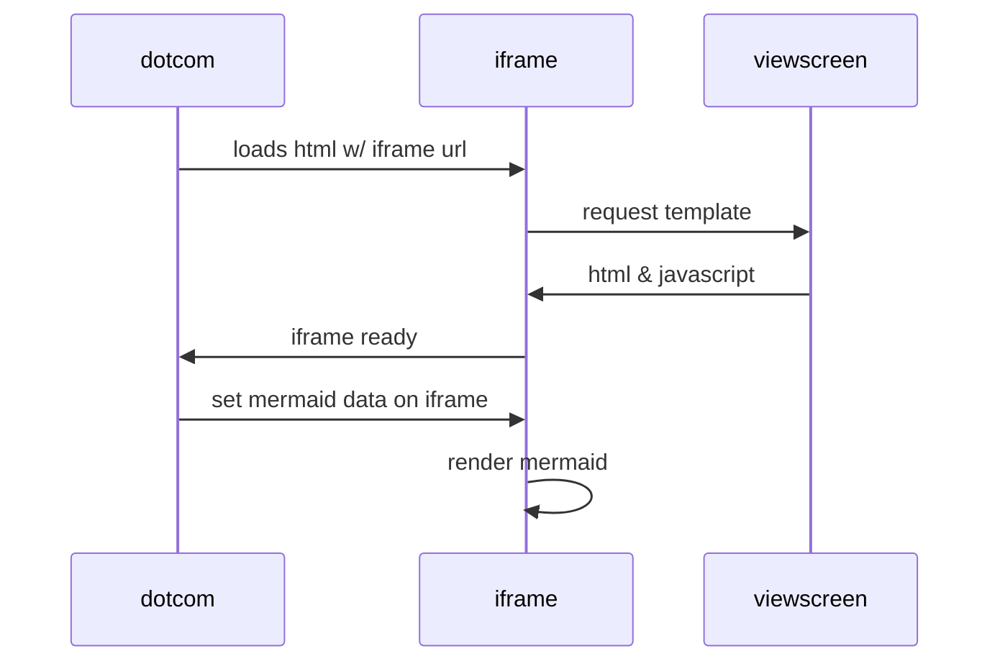
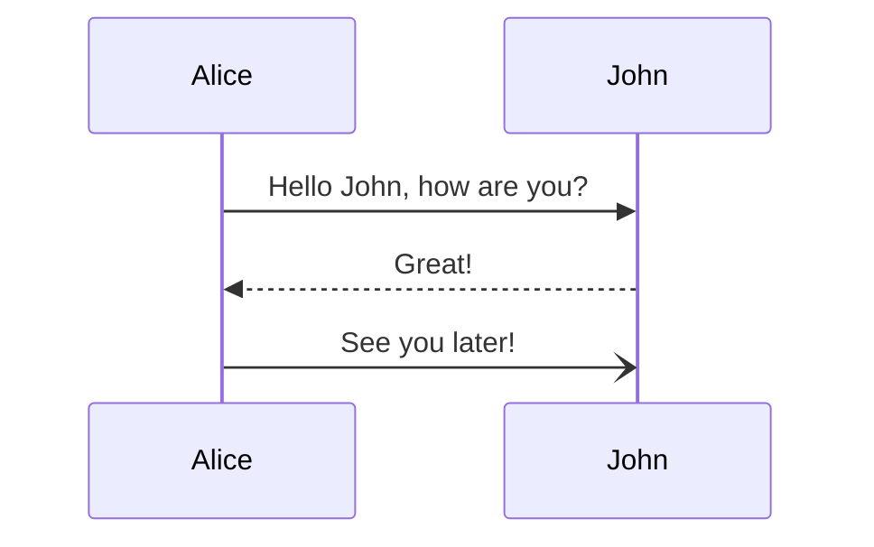
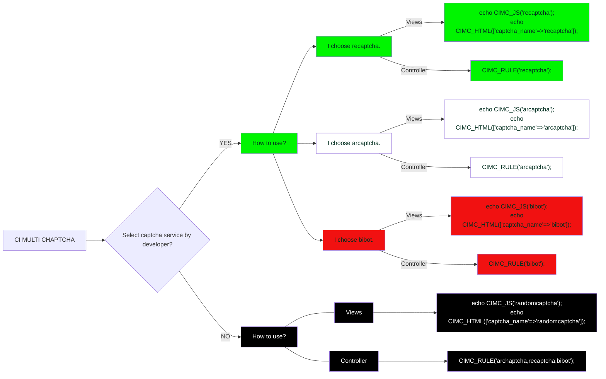

```diff
+ a -- a --> a
- b -- b --> s
```
a -- a --> a
b -- b --> s

${\color{red}Letras color rojo}$








When $a \ne 0$, there are two solutions to $(ax^2 + bx + c = 0)$ and they are 
$$ x = {-b \pm \sqrt{b^2-4ac} \over 2a} $$
**The Cauchy-Schwarz Inequality**
$$\alpha, \Alpha, \beta, \Beta, \gamma, \Gamma, \pi, \Pi, \phi, \varphi, \mu, \Phi \cos (2\theta) = \cos^2 \theta - \sin^2 \theta, Esto, usa, latex$$
$$\left( \sum_{k=1}^n a_k b_k \right)^2 \leq \left( \sum_{k=1}^n a_k^2 \right) \left( \sum_{k=1}^n b_k^2 \right) x \equiv a \pmod{b}$$
$$\frac{n!}{k!(n-k)!} = \binom{n}{k}$$
$$\begin{equation} x = a_0 + \cfrac{1}{a_1 + \cfrac{1}{a_2  + \cfrac{1}{a_3 + \cfrac{1}{a_4} } } }\end{equation}$$
$$\sqrt[n]{1+x+x^2+x^3+\dots+x^n}$$


```mermaid 

```

<details>
<summary>Menu desplegable </summary>
<pre>
488 cd /opt/LLL/controller/laser/
489 vi LLLSDLaserControl.c
490 make 
491 make install
492 ./sanity_check
493 ./configure -o test.cfg
494 vi test.cfg
495 vi ~/last_will_and_testament.txt
496 cat /proc/meminfo
497 ps -a -x -u
498 kill -9 2207
499 kill 2208
500 ps -a -x -u
501 touch /opt/LLL/run/ok
502 LLLSDLaserControl -ok1
</pre>
</details>