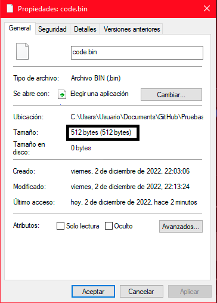
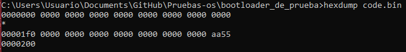

# Creando nuestro primer bootloader
----
Empezar diciendo que es un bootloader. Tambien conocidos como cargadores de arranque, es el de los primeros programas en ser ejecutados por nustro PC al encenderle.
Un cargador tiene varias funciones a realizar, activar la linea A20 o cargar nuestro kernel es una de esas tareas.
El cargador de arranque se a de encontrar en el primer sector de nuestro disco, y a de estar formado por `512 Bytes`. Ademas a de cargarse en memoria en unas direciones especificas, a de estar entre la direcion de inicio `0x7c00` y la direcion `0x7e00`. Cabe mencionar que son direciones de memoria de 16bits ya que estamos en modo real, esto es debido a que nuestro PC, por defecto inicia en el modo de direcionamiento real, y es el bootloader el encargado de activar el modo protegido, extendido o el que se requiera.
En esta foto podemos ver la estructura de memoria de lo que ocurre en nuestro PC:
- Podemos situar el vector de la tabla de interupciones entre las direciones `0x0000 - 0x0400`.
- Situamos un area de datos para el BIOS entre las direciones `0x0400 - 0x0500`.
- Encontramos un areas libres de uso entre las direciones `0x0500 - 0x7c00`, `0x00007e00 - 0x0009fc00` y apartir de la direcion `0x00100000` para adelante.
- Encontramos el MBR (Master Boot Record) o sector de arranque, o arranque maestro, como mas gustes llamarlo, enntre las direciones de memorias `0x7c00 - 0x7e00`.
- Entre las direciones de memoria `0x0009fc00 - 0x000A0000` Encontramos una secion de datos extendida para el BIOS.
- Entre las direciones `0x000A0000 - 0x000C0000`, encontramos la memoria de video.
- Por ultimo encontramos entre las direciones `0x000C0000 - 0x00100000` un area de datos donde se aloja el programa BIOS cargado en memoria.
- Todo lo posteior a la secion `0x00100000` esta fuera de libre uso para la creacion de nuestro OS (Operative System).

----
## Sector de arranque (MBR):
El sector de arraque es en teoria el primer sector (sector 0), de un dispositivo de almacanamiento. Tecnicamente el MBR y el sector de arranque no son lo mismo, pero por simplifidad los trataremos como sinonimos. El sector de arranque es donde alogaremos nuestro codigo del cargador de arranque, aunque no solo se suele usar para alojar el codigo del bootloader.

|Bytes|Descripcion|
|:-------------:|:---------------------------------------------------------------------------------------------------------------------------------------:|
|**`446 Bytes`**| Codigo maquina, se puede usar los ultimos `6 Bytes` para meter `4 Bytes` de firma de disco y 2 bytes adicionales que suele ser `0x0000`.|
|**`64 Bytes`** | Se usan para definir la tabla de partciones (se tiene 4 registros de `16 Bytes` donde se define cada una de las particiones primarias). |
|**`2 Bytes`**  | Firma de MBR que son `0x55aa`.                                                                                                          |

Aqui describimos el uso de cada offset de los registros que definen las particiones primarias.
|offset|Descripcion|
|:----:|:----:|
|**`0x00`**| Estado.|
|**`0x01`**| Cilindro-Cabezal-Sector(CHS = Cylinder-Head-Sector) del primer sector de la partcicion.|
|**`0x04`**|Tipo de particion.|
|**`0x05`**| Cilindro-Cabezal-Sector(CHS = Cylinder-Head-Sector) del ultimo sector de la partcicion.|
|**`0x08`**| (4 Bytes) Logic loc Address(LBA) del primer  sector de la particion.|
|**`0x0c`**| (4 Bytes) Longitud de la particion en sectores .|

Aqui el valor que se a de colocar en el offset 0x04 de nuestros registros para definir el tipo de particion.
|valor|tipo|
|:--------:|:------------------------------------------------------:|
|**`0x00`**| Empty = Vacio.                                         |
|**`0x01`**| DOS 12-bit Fat = FAT12.                                |
|**`0x02`**| XENIX root.                                            |
|**`0x03`**| XENIX /usr.                                            |
|**`0x04`**| DOS 3.0+ 16-bits FAT (up to 32M) = FAT16.              |
|**`0x05`**| DOS 3.3+ Extended Partition = particion extendida DOS. |
|**`0x06`**| DOS 3.31+ 16-bits FAT (over to 32M) = FAT16.           |
|**`0x07`**| OS/2 IFS.                                              |
|**`0x07`**| Windows NT NTFS.                                       |
|**`0x07`**| ExFat.                                                 |
|**`0x07`**| Advanced Unix.                                         |
|**`0x07`**| QNX2.x pre-1988.                                       |
|**`0x08`**| OS/2 (v1.0-1.3 only).                                  |
|**`0x08`**| AIX boot partition.                                    |
|**`0x08`**| SplitDrive.                                            |
|**`0x08`**| Commodore DOS.                                         |
|**`0x08`**| DELL partition spanning multiple drives.               |
|**`0x08`**| QNX 1.x and 2.x (qny).                                 |
|**`0x09`**| AIX data paratition.                                   |
|**`0x09`**| QNX 1.x and 2.x (qnz).                                 |
|**`0x0a`**| OS/2 Boot Manager                                      |
|**`0x0a`**| Coherent swap partition                                |
|**`0x0a`**| Opus                                                   |
|**`0x0b`**| WIN95 OSR2 FAT32.                                      |
|**`0x0c`**| WIN95 OSR2 FAT32, LBA-mapped.                          |
|**`0x0d`**| Silicon safe.                                          |
|**`0x0e`**| WIN95 DOS 16-bit FAT, LBA-mapped.                                            |
|**`0x0f`**| WIN95: Extended partition, LBA-mapped.                 |
|**`0x10`**| OPUS (?).                                              |
|**`0x0e`**| Hidden DOS 12-bit FAT                                  |
|**`...`**| ...                                                     |
----

## Requisitos minimos para programar nuestro bootloader simple:

- Necesitamos minimo saber `Assembly x86` (`asm`), en especifico estaremos usando sintaxis `intel` y escribiendo codigo de `16 bits` principalmete.
- En cuanto al software que necesitaremos minimo sera lo siguiente:

    1. __`nasm`__. Lo usaremos para generar binario planos mediante codigo ensamblador
    2. __`binutools`__ (gcc/g++, hexdump, as, objdump...). Principalmente estaremos aqui usado hexdump y objdump para estudiar nuestro codigo compilado. Aunque si teneis algun desensablador que os guste mas podeis usarlo siempre que lo useis de la forma correcta, recordar que es codigo x86 de 16bits, vuestro desensamblador no a de leer el codigo en 64bits o 32bits sino en 16bits.
    3. __`qemu-system-x86_64`__. Lo usaremos para ejecutar nuestro bootloader usando virtualizacion.

- En cuanto a nivel de hadware, __no necesitamos nada especial__, algo con lo que puedas instalar todas estas herramientas es sufieciente. da igual si es linux o windows, al final no influye en nuestro desarollo mientras nos permita trabajar de forma comoda. Pongamos de ejemplo lo mas basico, una PC con un Ubuntu de 32bits o un Windows 10 live de 32bits, con un procesador intel basico y 60Gb de ROM, aunque al final da igual. Como estamos haciendo un bootloader virtualizado, lo primero es que no vamos a ser capaz de aprovechar todos los recursos ya que como mucho estaremos lellendo y escribiendo en pantalla y en el disco 4 cosas. La arquitectura real del pc da igual, como lo estamos ejecutando sobre una `VM (Virtual Maching = Maquina Virtual) x86 ` al final se estara emulando una maquina para la que el bootloader esta destinado.
----

## Empezamos con lo basico:

Lo primero que haremos sera cojer un editor de codigo que nos facilite la escritura del mismo, y crearemos un archivo que se llame por ejemplo "`boot.asm`", en este archivo estaremos escribiendo el codigo de nuestro cargador como tal.

Una vez creado nuestro archivo primero debemos usar la directiva:
```nasm
[bits 16]
```
No es necesario poner los corchetes, pero a mi me gusta mas asi. Esto no es una instrucion en ensamblador, sino una directiva de `nasm` con la que le especificaremos, que desde que se situo esta directiva hasta la proxima directiva de tipo `bits`, el codigo sera de tipo `16 bits`. 
Acontinuacion debemos escribir dos directivas mas importantes para nuestra tarea, estas son las siguientes:
```nasm
times 510 -( $ - $$ ) db 0 
dw 0xaa55
```
Este fragmento de codigo ira al final de nuestro bootloader, lo que hace es sencillo. La primer directiva `times 510 -( $ - $$ ) db 0` Calcula la cantidad de numeros `0` de relleno que tendra que añadir para que nuestro bootloader llegue a `510 bytes`, si nuestro codigo ocupa `12 bytes`, esta directiva hara la siguiente operacion `510 - 12 = 498 bytes` que seran rellenos de 0. A continuacion, nuestra directiva `dw 0xaa55` escribe un `word` lo cual son `2 bytes`, `0xaa55 = 0xaa 0x55` esto lo escribe al final del archivo para firmar nuestro MBR, se podria decir que es nuestra "palabra magica" y sin ella las cosas no funcionaran como deben. Una vez explicada cada directiva, debemos darnos cuenta que la primera directiva rellena nuestro binario con valores nulos hasta alcanzar los `510 bytes` y que con la siguiente directiva escribimos otros `2 bytes`, por lo que en total tenemos `510 + 2 = 512 bytes` de binario, esto es importante ya que nuestro bootloader solo puede tener como tal `512 bytes` ya que nuestro sector de arranque empieza en `0x7c00 = 31744` y acaba en `0x7e00 = 32256`, con una simple cuenta nos damo cuenta de que solo se dispone de `32256 - 31744 = 0x7e00 - 0x7c00 = 512 bytes` de espacio para nuestro sector de arranque. Aun asi, hay tecnicas para aumentar el tamaño de nuestro codigo, aunque un buen bootloader tampoco necesita recurrir estas tecnicas.
Podemos compiladr nuestro codigo `asm` con el siguiente comando:
```batch bach
nasm -f bin boot.asm -o code.bin
```
Aqui le decimas a nasm que el formato de nuestro binario es de tipo __"binario plano__" mediante el `-f bin`, acontinuacion especificamos el archivo que contiene nuestro codigo asm (`boot.asm`) y con la flag `-o` decimos que el nombre del archivo de salida es `code.bin`. Esto nos genera una rchivo binario de `512 bytes`

Ahora vamos a ver el codigo hexadecimal que se a generado haciendo uso en mi caso de `hexdump`:
```batch bach
 hexdump code.bin
```

Como podemos observar, todo el codigo son valores nulos (`0x00 0x00 = 0x0000`) excepto los 2 ultimos bytes del binario que son `0xaa55` como especificamos nosotros. Tmb podemos observas que nos han puesto un hasterisco de por medias el cual indica que nos han acortado el resultado debido a que en esas direciones de memoria se siguen teniendo los mismo valores, los cuales son nulos. Podemos especificar que se nos muestre toda la salida completa con el argumento `-v` en hexdump. Cabe mencionar, que la columna de la izquierda indica la direcion de memoria, y las demas son los datos(el codigo de nuestro binario en hexadecimal), en la posicion `0x0000` de nuestro binario tenemos el valor `0x0`, lo mismo en la posicion `0x0001` y asi hasta la posicion `0x1fe`, que tiene el valor `0xaa` y la posicion `0x1ff` que tiene el valor `0x55`. Estas direciones de memoria se pueden calcular con la columna de la izquierda. Por cada fila, se muestran una cantidad de `16 bytes`, estos van desde `0x0 a 0xf` o lo que es lo mismo en decimal, de `0 a 15`. Para calcular nuestra direcion de memoria en la que se encuentra el byte `0xaa`, situamos la fila mediante la columa de direciones de memoria, nuestra fila en este caso es la `0x01f0`, a continuacion buscamos la columna donde se situa nuestro byte, en esta caso, el byte esta en la columna `0xe` asi que `0x01f0 + 0xe = 0x01fe`, nuestro caracter esta en `0x01fe`.


|`addres` | `0`| `1`| `2`| `3`| `4`| `5`| `6`| `7`| `8`| `9`| `a`| `b`| `d` |`d`| `e`| `f`|
|:-------:|:--:|:--:|:--:|:--:|:--:|:--:|:--:|:--:|:--:|:--:|:--:|:--:|:--:|:--:|:--:|:--:|
|`0000000`|`00`|`00`|`00`|`00`|`00`|`00`|`00`|`00`|`00`|`00`|`00`|`00`|`00`|`00`|`00`|`00`|
|    *    |....|....|....|....|....|....|....|....|....|....|....|....|....|....|....|....|
|`00001f0`|`00`|`00`|`00`|`00`|`00`|`00`|`00`|`00`|`00`|`00`|`00`|`00`|`00`|`00`|`aa`|`55`|
|`0000200`|   F|   I|   N|:)  |D   |   E|   L|:(  |   A|   R|   C|   H|   I|   V|   O|   .|
----  

Ahora vamos a intentar mostar algo por pantalla, para ello haremos uso de la interupcion `10h = 0x10` del BIOS. Para esto se usa registro para especifar el servicio a usar y su configuracion. Nosotros usaremos los serivicios de video para imprimir informacion y especifar la resolucion mediante el modo de video. Para especificar el modo de video, debemos darle al registro `ah` el valor `0x00`, esto podemos hacerlo con un `mov ah, 0` o con un `xor ah, ah`. En el registro `al`, especificaremos el modo de video que queremos usar, por ejemplo, si ponemos en al el valor 0x00 `mov al, 0x00`, tendremos una resolucion de 40x25 con colores en Blanco y Negro (Monocromatico). Cabe mencionar, que para aplicar los cambios, debemos llamar a la interupcion `10h` mediante un `int 0x10` para efecutar la operacion. A continuacion los distintos modos de video disponibles:

|Valor Para AL|Resolucion|Modos que permite|
|:---:|:---:|:---:|
`0x00` |    40x25    |   B/W texto (CGA,EGA,MCGA,VGA)
`0x01` |    40x25    |   16 texto a color (CGA,EGA,MCGA,VGA)
`0x02` |    80x25    |   16 texto en tonos de gris (CGA,EGA,MCGA,VGA)
`0x03` |    80x25    |   16 texto a color (CGA,EGA,MCGA,VGA)
`0x04` |    320x200  |   4 gráficos a color (CGA,EGA,MCGA,VGA)
`0x05` |    320x200  |   4 gráficos a color (CGA,EGA,MCGA,VGA)
`0x06` |    640x200  |   Gráficos en B/N (CGA,EGA,MCGA,VGA)
`0x07` |    80x25    |   Texto monocromático (MDA,HERC,EGA,VGA)
`0x08` |    160x200  |   Gráficos de 16 colores (PCjr)
`0x09` |    320x200  |   Gráficos de 16 colores (PCjr)
`0x0A` |    640x200  |   Gráficos de 4 colores (PCjr)
`0x0B` |    Reservado|   (EGA BIOS función 11)
`0x0C` |    Reservado|   (EGA BIOS función 11)
`0x0D` |    320x200  |   Gráficos de 16 colores (EGA,VGA)
`0x0E` |    640x200  |   Gráficos de 16 colores (EGA,VGA)
`0x0F` |    640x350  |   Gráficos monocromáticos (EGA,VGA)
`0x10` |    640x350  |   Gráficos de 16 colores (EGA or VGA with 128K) o de 4 colores (64K EGA)
`0x11` |    640x480  |   Gráficos B/N (MCGA,VGA)
`0x12` |    640x480  |   Gráficos de 16 colores (VGA)
`0x13` |    320x200  |   Gráficos de 256 colores (MCGA,VGA) 

Nosotros por ahora con usar el primer modo de video, de 40x25 con texto en B/H, nos es suficiente. Para ello usaremos el siguiente fragmento de codigo.

```nasm
mov ah, 0x00  ; Servicio de modo video
mov al, 0x00  ; Modo de video 0x00
int 0x10      ; Interupcion 10H al BIOS
```
----
Aunque con esto no hemos escrito aun nada, veamos como hacer esto. Para escribir texto en modo teletipo, tenemos el servicio de `escribir texto en Modo teletipo`. Este servicio es el `0x0e`. En el registro `al` se recibe un caracter `ASCII`, en el registro `bh` el numero de pagina y en el `bl` el color(para modos graficos).
```
- el cursor avanza después de escribir
- los caracteres BEL (7), BS (8), LF (A) y CR (D) son
tratados como códigos de control
- para algunas BIOS más antiguas (19/10/81), el registro BH debe
apuntar a la página mostrada actualmente
- en los adaptadores CGA esta función puede deshabilitar la señal de video mientras se realiza la
salida que causa flitter.
```
Por lo que nuestro codigo quedaria asi, si queremos escribir un caracter `'H'` por ejemplo:
```nasm
mov ah, 0x0e  ; Servicio de texto en Modo teletipo
mov al, 'H'   ; Mover el valor del caracter 'H' al registro al
int 0x10      ; Interrupcion al BIOS mediante 10h
```
----

Ahora hay que preguntarse, todo este codigo que hemos estado, donde podemos ponerlo. Este codigo es recomendable escribirlo apartir de una etiqueta, podeis llamarla como querais, en mi caso la llamare `start` y es donde empezara el codigo de mi bootloader. Debemos poner apartir de la directiva `[bits 16]` un `jmp` a nuestra etiqueta por cuestiones de seguridad, ya que si introducimos datos antes del codigo, y la maquina los lee, los tratara como instruciones, y como no  queremos que un string sea ejecutada como instruciones, indicamos que antes de llegar a esta secion de datos si es que existe, salta a nuestra etiqueta donde se aloja el codigo que si queremos ejecutar. Como tal no tenemos seciones, como en un programa convencional, no tenemos un `.data`, `.bss` o `.text`, es por eso que para nuestro ordenador, un string, una direcion de memoria, o una instrucion, seran ejecutas sin distincion. Resumiendo todo, con el `jmp` saltamos  directamente a nuestro codigo nada mas el PC empieze a ejecutar nuestro codigo, de esta manera, podemos escribir los datos que necesitemos entre `jmp start` y la etiqueta `start`.
Otra cosa importante es hacer un `jmp $`, para el que no sepa que es esto, es hacer un salta a la misma direcion donde se encuentre esta instrucion, haciendose un bucle infinito. ¿Por que queremos esto? La respuesta es sencilla, una vez finalize el codigo de nuestro bootloader, si el PC no encuentra "nada mas que hacer" finalizara el programa y no queremos eso, para solucionarlo, hacemos un salto a si mismo, entrando en este bucle infinito que deja corriendo nuestro codigo hasta que se apage la maquina.

Por ahora, tenemos esto de codigo en nuestro archivo `boot.asm`:
```nasm
[bits 16]         ; Se quiere escribir codigo de 16 bits
jmp start         ; Saltamos directamente a la etiqueta
                  ; que contiene el codigo de nuestro
                  ; bootloader.


start:
    mov ah, 0x00  ; Servicio de modo video
    mov al, 0x00  ; Modo de video 0x00
    int 0x10      ; Interupcion 10H al BIOS

    mov ah, 0x0e  ; Servicio de texto en Modo teletipo
    mov al, 'H'   ; Mover el valor del caracter 'H' al registro al
    int 0x10      ; Interrupcion al BIOS mediante 10h

    jmp $


times 510 -( $ - $$ ) db 0 ; Rellenar con valores nulos
                           ; hasta que se alcance 510 bytes
dw 0xaa55                  ; escribir al final del binario 
                           ; los bytes 0xaa y 0x55 para
                           ; firmar el MBR
```