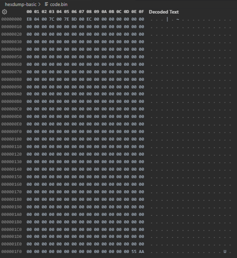

# Uso Basico

Hexdump es un programa que nos permite __"dumpear"__ un programa binario, es decir, nos permite leer su contenido de una manera comoda indicandonos su contenido en binario, octal, decimal, hexadecimal o ascii. Este programa nos ayudara a estudiar el codigo de nuestros binarios y poder ver el tamaño de una instrucion en ensamblador traducido a codigo de ejecutable.

----
## Codigo ASM usado epara los ejemplos:

```nasm
    dw 0x04eb
    dw 0x7c00
    dw 0x7e00
    dw 0x00bd 
    dw 0x00ec

    times 510 -( $ - $$ ) db 0
    dw 0xaa55
```

Este codigo lo hemos compilado usando el siguiente comando: [ __`nasm -f bin bin_hex_dump.asm -o code.bin`__ ], lo cual nos genera un binario de 512bytes llamado code.bin.



----
## Hexdump contiene estos parametros:

```batch
    [*] Options:
    -b, --one-byte-octal      one-byte octal display
    -c, --one-byte-char       one-byte character display
    -C, --canonical           canonical hex+ASCII display
    -d, --two-bytes-decimal   two-byte decimal display
    -o, --two-bytes-octal     two-byte octal display
    -x, --two-bytes-hex       two-byte hexadecimal display
    -L, --color[=<mode>]      interpret color formatting specifiers
                                colors are enabled by default
    -e, --format <format>     format string to be used for displaying data
    -f, --format-file <file>  file that contains format strings
    -n, --length <length>     interpret only length bytes of input
    -s, --skip <offset>       skip offset bytes from the beginning
    -v, --no-squeezing        output identical lines

    -h, --help                display this help
    -V, --version             display version
    For more details see hexdump(1).
```

- Todos estos parametros podemos listarlos con -h o --help
----
- [__-v__] Por defecto, hexdump no nos mostrara los valores de un rango de memoria si estas son los mismos, por ejemplo, supongamos que desde la posicion `0x0000010` hasta la posicion `0x00001e0` solo tenemos unicamente valores `0x00` (nop). Solo se nos mostrata una pequeña parte de todo este para facilitar su lectura, pero si por alguna casualidad deseamos ver este contenido, el parametro `-v` nos muestra todo sin excepcion (hexdump nos indicara una acortacion con un asterisco *):

### Acortado:


```C
    PS C:\Users\Usuario\Documents\GitHub\Pruebas-os> hexdump code.bin
    0000000 04eb 7c00 7e00 00bd 897e 00ec 0000 0000
    0000010 0000 0000 0000 0000 0000 0000 0000 0000
    *
    00001f0 0000 0000 0000 0000 0000 0000 0000 aa55
    0000200
```

### Sin acortar (Parametro -v):

```C
    PS C:\Users\Usuario\Documents\GitHub\Pruebas-os> hexdump -v code.bin
    0000000 04eb 7c00 7e00 00bd 897e 00ec 0000 0000
    0000010 0000 0000 0000 0000 0000 0000 0000 0000
    0000020 0000 0000 0000 0000 0000 0000 0000 0000
    0000030 0000 0000 0000 0000 0000 0000 0000 0000
    0000040 0000 0000 0000 0000 0000 0000 0000 0000
    0000050 0000 0000 0000 0000 0000 0000 0000 0000
    0000060 0000 0000 0000 0000 0000 0000 0000 0000
    0000070 0000 0000 0000 0000 0000 0000 0000 0000
    0000080 0000 0000 0000 0000 0000 0000 0000 0000
    0000090 0000 0000 0000 0000 0000 0000 0000 0000
    00000a0 0000 0000 0000 0000 0000 0000 0000 0000
    00000b0 0000 0000 0000 0000 0000 0000 0000 0000
    00000c0 0000 0000 0000 0000 0000 0000 0000 0000
    00000d0 0000 0000 0000 0000 0000 0000 0000 0000
    00000e0 0000 0000 0000 0000 0000 0000 0000 0000
    00000f0 0000 0000 0000 0000 0000 0000 0000 0000
    0000100 0000 0000 0000 0000 0000 0000 0000 0000
    0000110 0000 0000 0000 0000 0000 0000 0000 0000
    0000120 0000 0000 0000 0000 0000 0000 0000 0000
    0000130 0000 0000 0000 0000 0000 0000 0000 0000
    0000140 0000 0000 0000 0000 0000 0000 0000 0000
    0000150 0000 0000 0000 0000 0000 0000 0000 0000
    0000160 0000 0000 0000 0000 0000 0000 0000 0000
    0000170 0000 0000 0000 0000 0000 0000 0000 0000
    0000180 0000 0000 0000 0000 0000 0000 0000 0000
    0000190 0000 0000 0000 0000 0000 0000 0000 0000
    00001a0 0000 0000 0000 0000 0000 0000 0000 0000
    00001b0 0000 0000 0000 0000 0000 0000 0000 0000
    00001c0 0000 0000 0000 0000 0000 0000 0000 0000
    00001d0 0000 0000 0000 0000 0000 0000 0000 0000
    00001e0 0000 0000 0000 0000 0000 0000 0000 0000
    00001f0 0000 0000 0000 0000 0000 0000 0000 aa55
    0000200
```

Si es una salida muy grande, podemos hacer lo siguiente para que nos muestre la salida de forma mas controlada, presionando enter avanzamos a la siguiente linea, si se requiere salir, pulsando la tecla 'q' podemos salir.
`hexdump -v code.bin | more`
Basicamente redirecionamos la salida del comando hexdump como la entrada para el comando more, el cual nos muestra los datos con pausaciones.

----
- [__-s__] Este parametro nos permite saltar un offset  que queramos, recibe por parametro la cantidad de bytes del offset. Un ejemplo seria hacer `hexdump -s 10 code.bin`. Lo cual nos mostraria el contenido del binario apartir de los primeros 10bytes iniciales.
----
- [__-n__] Este parametro especifica la cantidad de bytes a leer (offset). Ejemplo hexdump -n 10 code.bin. Esto nos leera unicamente los primeros 10bytes del binario.
----

### Usando -n y -s para leer un rango: 
podemos combinar ambos para leer unciamente un rango de direciones de memoria, supongamos que queremos leer desde [`0x0000010 - 0x0000020`], para esto, pasamos la direcion de memoria inicial a decimal 0x0000010 = 16, y los mismo con la final, `0x0000020 = 32`. Esto quiere decir que tenrmos un offset de `32 - 16 = 16 Bytes` que leer, dicho offset empieza en la direcion decimal 16 y acaba en la direcion decimal 32, por lo que con este calculo hecho realizamos lo siguiente: `hexdump -n 16 -s 16 code.bin`. Esto salta los primeros 16bytes, situandonos en la direcion `0x0000010` mediante el parametro `-n`, y mediante `-s 16`, especificamos que solo queremos leer `16 bytes`, lop cual lee hasta la cirecion `0x0000020` ya que `0x0000010 + 0x10 = 0x0000020`. 0x10 es 16 en decimal.

```C
    PS C:\Users\Usuario\Documents\GitHub\Pruebas-os> hexdump -n 16 -s 16 code.bin
    0000010 0000 0000 0000 0000 0000 0000 0000 0000
    0000020
```
----

- [__-b__] Este parametro nos da como salida, los valores en formato Byte octal, es decir, un byte octal se forma 8**3, lo que nos da un rango octal de entre [`777 - 000`]:

```C
    Decimal          Octal
    0                  0
    1                  1
    2                  2
    3                  3
    ...               ...
    6                  6
    7                  7
    8                  10
    9                  11
    10                 12
    100               144
    256               400
    511               777
```

```C
    PS C:\Users\Usuario\Documents\GitHub\Pruebas-os> hexdump -b code.bin
    0000000 353 004 000 174 000 176 275 000 176 211 354 000 000 000 000 000
    0000010 000 000 000 000 000 000 000 000 000 000 000 000 000 000 000 000
    *
    00001f0 000 000 000 000 000 000 000 000 000 000 000 000 000 000 125 252
    0000200
```
----

- [__-c__] Este parametro nos da la salida en forma de caracteres legibles:


```C
    PS C:\Users\Usuario\Documents\GitHub\Pruebas-os> hexdump -c code.bin
    0000000 353 004  \0   |  \0   ~ 275  \0   ~ 211 354  \0  \0  \0  \0  \0
    0000010  \0  \0  \0  \0  \0  \0  \0  \0  \0  \0  \0  \0  \0  \0  \0  \0
    *
    00001f0  \0  \0  \0  \0  \0  \0  \0  \0  \0  \0  \0  \0  \0  \0   U 252
    0000200
```
----

- [__-C__] Este parametro nos muestra una salida estandar de bytes tipo hexadecimal clasico pero con un apartado en la derecha donde se representa cada byte hexadecimal con un caracter `ASCII`:

```C
    00000000  eb 04 00 7c 00 7e bd 00  7e 89 ec 00 00 00 00 00  |...|.~..~.......|
    00000010  00 00 00 00 00 00 00 00  00 00 00 00 00 00 00 00  |................|
    *
    000001f0  00 00 00 00 00 00 00 00  00 00 00 00 00 00 55 aa  |..............U.|
    00000200
```
----

- [__-d__] Este parametro nos muestra el resultado en forma de numeros decimales formados por `2bytes` cada uno, la operacion que realiza es la siguiente:
```python
 b = 0x89 = 137,   a  =  0x7e = 124
b   * 16 * 16  +   a   * 16 
137 * 16 * 16  +   124 * 16 = 35198 
```

```C
    PS C:\Users\Usuario\Documents\GitHub\Pruebas-os> hexdump -d code.bin
    0000000   01259   31744   32256   00189   35198   00236   00000   00000
    0000010   00000   00000   00000   00000   00000   00000   00000   00000
    *
    00001f0   00000   00000   00000   00000   00000   00000   00000   43605
    0000200
```
----
- [__-x__] Este parametro nos mostrara el resultado en formato de numeros de `2 bytes` hexadecimales:


```C
    0000000    04eb    7c00    7e00    00bd    897e    00ec    0000    0000
    0000010    0000    0000    0000    0000    0000    0000    0000    0000
    *
    00001f0    0000    0000    0000    0000    0000    0000    0000    aa55
    0000200
```
----